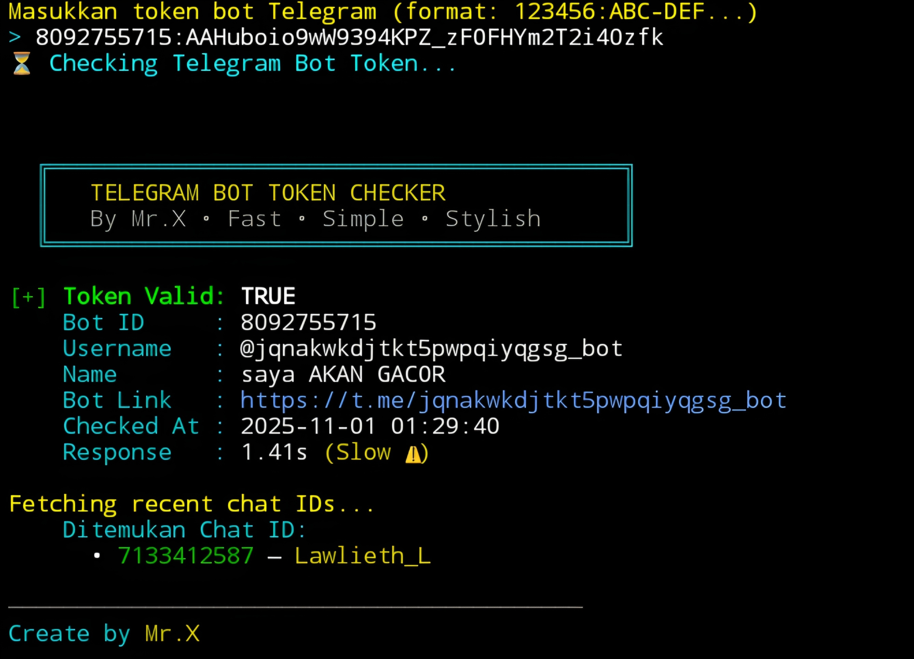

# telebot-token-checker


## introduction
*telebot-token-checker* is a tool to see whether the Telegram bot token is valid or not along with other features to generate bot ID and also chat ID and complete bot username and also link to the bot.

## Instalations
```
$ pkg update -y && pkg upgrade -y
$ apt update -y && apt upgrade -y
$ pkg install git
$ pkg install python -y
$ git clone https://github.com/Whomrx666/telebot-token-checker.git
$ cd telebot-token-checker
$ pip install -r requirements.txt
$ python3 telebot-token-checker.py
```

## Instructions
- **first**: Install tools according to the instructions above.
- **second**: After it is installed, Enter the Telegram bot token you want to check.
- **third**: After you enter the tool, it will automatically search for complete information about the bot.
- **last**: This information is very useful for you to do many things.


## Feature
| All feature | ⚡ |
|--------|--------|
| **Check Valid token or Not** | ✅ |
| **Check BOT id** | ✅ |
| **Check Username bot** | ✅ |
| **Check Name bot** | ✅ |
| **Check Bot link** | ✅ |
| **Check Response** | ✅ |
| **Check Chat id** | ✅ |
---------

## Note!
If you want to check the chat ID, you have to interact with the target bot first, such as sending a chat first, then you can use the tool.

## Observation
This is a tool for education only, I am not responsible for any misuse
### Original Author
<a href="https://github.com/Whomrx666"></a>

### <<< If you copy , Then Give me The Credits >>>

## CONNECT WITH ME :

[](https://whomrxhackers.blogspot.com/)
[](https://twitter.com/whomrx666)
[](https://wa.me/6285926601133?text=Halo%2C%20Mr.X)
[](https://www.facebook.com/whomrx.666)
[](https://t.me/Whomr_X)
[](mailto:whomrx666@gmail.com)
[](https://www.tiktok.com/@whomr.x)

**If you want to donate, click on the button**
<a href="https://saweria.co/whomrx"></a>

---

<p align="left">
  
</p>

---